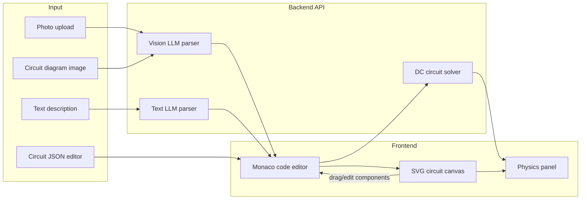
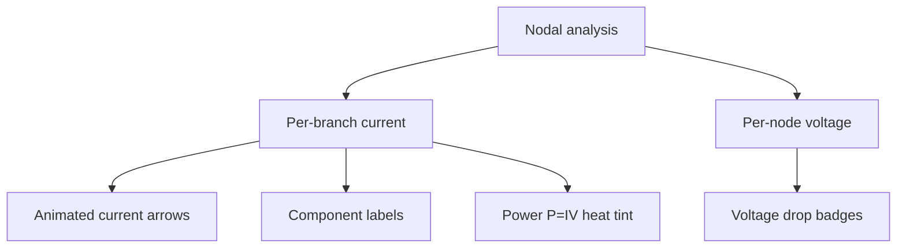

# Circuit Visualizer Website

## Goal

A local web app for HK Physics students that turns **photos**, **diagram images**, or **text descriptions** into an **interactive circuit diagram**, with an **editable circuit-definition code panel** and **animated electrical flow** (current, voltage, resistance, power).

## Architecture



## Project layout

Create a new project at [`c:\Users\2c30\circuit-visualizer`](c:\Users\2c30\circuit-visualizer):

```
circuit-visualizer/
  frontend/          # React + Vite + TypeScript
  backend/           # Node.js + Express (or Python FastAPI — Node keeps one language)
  shared/            # Circuit JSON schema + solver (shared types)
  .env.example       # OPENAI_API_KEY or GEMINI_API_KEY
  README.md          # Setup + example circuits for students
```

## Circuit definition format (the “code” on the website)

Human-readable JSON that students and developers can edit directly. Example:

```json
{
  "name": "Series resistors",
  "components": [
    { "id": "V1", "type": "voltage_source", "value": 12, "unit": "V", "nodes": ["n0", "n1"] },
    { "id": "R1", "type": "resistor", "value": 4, "unit": "ohm", "nodes": ["n1", "n2"] },
    { "id": "R2", "type": "resistor", "value": 8, "unit": "ohm", "nodes": ["n2", "n0"] }
  ],
  "layout": {
    "V1": { "x": 100, "y": 200 },
    "R1": { "x": 250, "y": 200 },
    "R2": { "x": 400, "y": 200 }
  }
}
```

Supported component types for **v1** (HK secondary Physics scope):

| Type | Symbol | Notes |
|------|--------|-------|
| `voltage_source` | Battery | DC only |
| `resistor` | Zigzag | Value in Ω |
| `wire` | Line | Zero resistance |
| `switch` | Open/closed | Boolean `closed` |
| `ammeter` | Circle A | Shows branch current |
| `voltmeter` | Circle V | Shows node voltage diff |
| `bulb` | Lamp | R = V²/P or fixed R |

**Bidirectional sync:** editing JSON re-renders the diagram; dragging components on canvas updates `layout` in JSON; adding/removing components updates `components` array.

## Input methods

### 1. Text description
- User types: *"12V battery in series with 4Ω and 8Ω resistors"*
- Backend sends text + JSON schema to LLM → returns validated circuit JSON
- Show parsing confidence; let user fix in code editor if AI misreads

### 2. Photo / diagram image
- User uploads JPG/PNG (phone photo of textbook, hand-drawn sketch, or printed diagram)
- Backend sends image to **vision-capable model** (OpenAI GPT-4o or Google Gemini) with a strict system prompt: output only circuit JSON matching our schema
- Post-process: validate JSON, flag unknown symbols, default layout if missing

### 3. Manual code editor
- [Monaco Editor](https://microsoft.github.io/monaco-editor/) embedded in left/bottom panel
- Syntax validation on blur; inline errors (e.g. dangling node, duplicate id)
- “Reset example” buttons for common HK syllabus circuits (series, parallel, mixed)

**API key handling:** stored in `backend/.env` only; never sent to browser. Frontend calls `POST /api/parse-text` and `POST /api/parse-image`.

## Electrical flow visualization

After the solver runs nodal analysis (DC, linear components):



**On the SVG canvas:**
- **Current flow:** animated dots/arrows along wires; speed ∝ |I| (capped for readability); direction = conventional current (+ → −)
- **Voltage:** color gradient or badges on each component (e.g. `ΔV = 4.0 V`)
- **Resistance:** label on each resistor (`R = 4 Ω`)
- **Totals panel:** equivalent resistance, total current, power per component
- **Study mode toggle:** step-by-step explanation in plain English (e.g. *"R₁ and R₂ are in series, so R_eq = 4 + 8 = 12 Ω"*) generated from solver results + optional LLM polish

**Interactive controls:**
- Sliders to change V or R values → instant re-solve + animation update
- Switch open/closed toggle
- Pause/play animation

**Solver scope (v1):** single DC source, resistors, switches; no capacitors/inductors/transistors yet (can extend schema later).

## UI layout

```
┌─────────────────────────────────────────────────────────────┐
│  [Upload Photo] [Upload Diagram]  │  Text: _____________  │
│                          [Generate Circuit]                 │
├──────────────────────┬──────────────────────────────────────┤
│  Circuit Code (JSON) │  Circuit Diagram (SVG + animations)  │
│  Monaco Editor       │  Zoom, pan, component drag           │
│  [Validate] [Format] │  Current / voltage overlays           │
├──────────────────────┴──────────────────────────────────────┤
│  Physics Results: I_total, R_eq, V drops, P, explanations  │
└─────────────────────────────────────────────────────────────┘
```

Clean, student-friendly styling (large labels, SI units, optional Traditional Chinese labels later).

## Tech stack

| Layer | Choice | Why |
|-------|--------|-----|
| Frontend | React 18 + Vite + TypeScript | Fast dev, component model |
| Diagram | Custom SVG renderer | Full control over animations |
| Code editor | `@monaco-editor/react` | Familiar VS Code editing |
| Backend | Express + multer (image upload) | Simple API proxy for LLM |
| AI | OpenAI or Gemini (user picks via env) | Photo + text parsing |
| Solver | Custom nodal analysis in `shared/solver.ts` | No heavy deps, testable |
| Validation | Zod schema for circuit JSON | Safe AI output parsing |

## Key files to implement

- [`shared/schema.ts`](c:\Users\2c30\circuit-visualizer\shared\schema.ts) — Zod circuit schema + types
- [`shared/solver.ts`](c:\Users\2c30\circuit-visualizer\shared\solver.ts) — DC nodal analysis, branch currents
- [`backend/src/routes/parse.ts`](c:\Users\2c30\circuit-visualizer\backend\src\routes\parse.ts) — `/api/parse-text`, `/api/parse-image`
- [`backend/src/llm/prompts.ts`](c:\Users\2c30\circuit-visualizer\backend\src\llm\prompts.ts) — Schema-constrained prompts
- [`frontend/src/components/CircuitCanvas.tsx`](c:\Users\2c30\circuit-visualizer\frontend\src\components\CircuitCanvas.tsx) — SVG symbols + current animation
- [`frontend/src/components/CodePanel.tsx`](c:\Users\2c30\circuit-visualizer\frontend\src\components\CodePanel.tsx) — Monaco + validation
- [`frontend/src/components/PhysicsPanel.tsx`](c:\Users\2c30\circuit-visualizer\frontend\src\components\PhysicsPanel.tsx) — numbers + study explanations
- [`frontend/src/hooks/useCircuitSync.ts`](c:\Users\2c30\circuit-visualizer\frontend\src\hooks\useCircuitSync.ts) — code ↔ diagram state

## AI prompt strategy (reliability)

Vision/text prompts will:
1. Require output as **only** JSON matching our schema
2. List allowed component types and node naming rules
3. Ask for best-guess `layout` coordinates if not inferable
4. Return `warnings[]` for ambiguous symbols (e.g. unclear parallel vs series)

Backend validates with Zod; if invalid, retry once with error feedback to LLM.

## Setup for you

1. `npm install` in `frontend/` and `backend/`
2. Copy `.env.example` → `backend/.env`, add `OPENAI_API_KEY=...` or `GEMINI_API_KEY=...`
3. `npm run dev` (concurrently starts frontend :5173 + backend :3001)
4. Open browser → upload textbook photo or type description → edit JSON → watch current flow

## Out of scope for v1 (future)

- AC circuits, capacitors, inductors
- Full SPICE netlist import
- Traditional Chinese UI (easy to add i18n later)
- User accounts / cloud save
- Mobile-native app (responsive web is enough)

## Risks and mitigations

| Risk | Mitigation |
|------|------------|
| AI misreads hand-drawn circuits | Editable JSON + warnings; manual fix is first-class |
| Complex non-planar layouts | Auto-layout heuristic + manual drag |
| Invalid circuits (short circuit) | Solver detects and shows clear error |
| API cost | Image parsing only on button click; cache last result locally |
